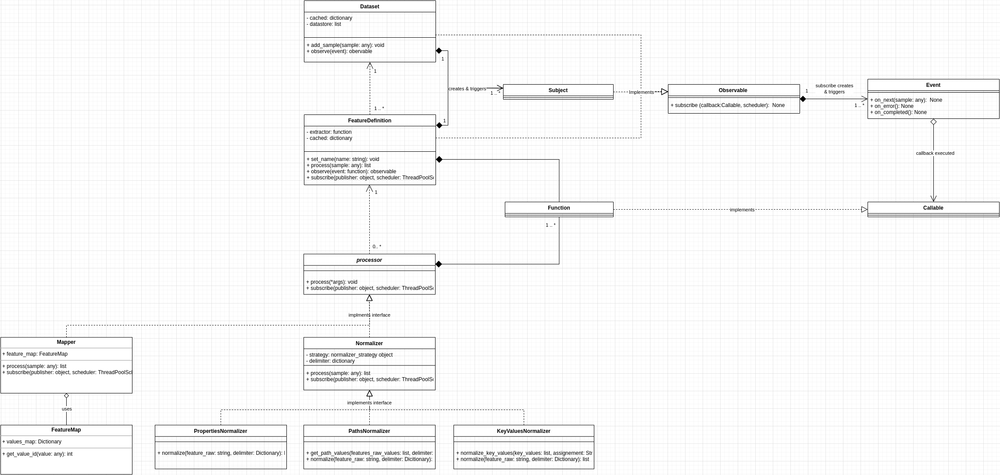

# Library Architecture

This section offers a deep dive into the core components that constitute
the Artifician library, explaining their roles, functionalities, and how
they interact with each other.

{width="800px"}

## Events

Events serve as the backbone of Artifician\'s event-driven architecture.
They provide the hooks that allow different components to communicate in
a decoupled manner. In this system, the entity that triggers an event is
known as the \"publisher,\" and the entity that listens to the event is
the \"observer.\" Essentially, events are Python functions that act as
communication channels between different parts of your application.

## Dataset

The Dataset is more than just a storage unit; it serves as the core
structure that holds and manages the prepared data. It emits events that
can be observed by other components like Feature Definitions and
Processors. Internally, the Dataset utilizes a
[pandas.DataFrame](https://pandas.pydata.org/) object to hold the
prepared data, offering a familiar interface for data manipulation and
analysis.

## Feature Definition

Feature Definitions are the workhorses of the Artifician library. They
are responsible for extracting specific features from raw data using an
\"extractor\" function. This extractor is a custom function that you
define to pick out the data you are interested in. Feature Definitions
act as both publishers and observers: they can emit their events and
also listen to events emitted by other publishers, including the
Dataset.

## Processors

Processors play a crucial role in shaping the data into a usable format.
They can perform a wide range of operations, from normalization to more
complex feature engineering tasks. Processors listen to events triggered
by publishers like Feature Definitions and act upon the data
accordingly. They are extendable, allowing you to define custom
processors that fit your specific needs.

## Extractors

Extractors are user-defined functions that you pass into the Feature
Definition component. Their role is to extract specific features from a
given sample of raw data. Think of them as the first line of data
transformation, essentially turning unstructured or semi-structured data
into something that can be processed further down the pipeline. They
serve as the bridge between the raw data and the Feature Definitions,
allowing you to tailor the data extraction process to your specific
needs.
