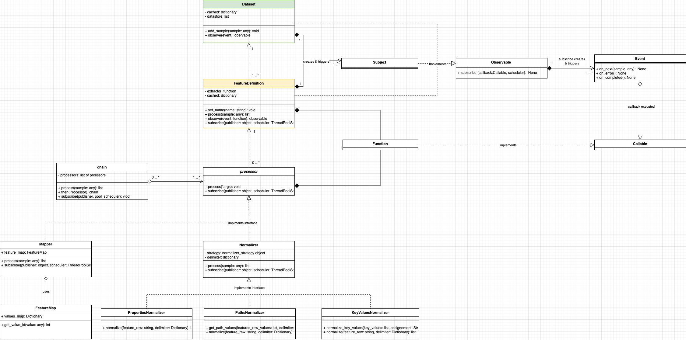

# Library Architecture

This section offers a deep dive into the core components that constitute the Artifician library, explaining their roles, functionalities, and how they interact with each other.

## Events

Events serve as the backbone of Artifician’s event-driven architecture. They provide the hooks that allow different components to communicate in a decoupled manner. In this system, the entity that triggers an event is known as the “publisher,” and the entity that listens to the event is the “observer.” Essentially, events are Python functions that act as communication channels between different parts of your application.

## Dataset

The Dataset is more than just a storage unit; it serves as the core structure that holds and manages the prepared data. It emits events that can be observed by other components like Feature Definitions and Processors. Internally, the Dataset utilizes a [pandas.DataFrame](https://pandas.pydata.org/) object to hold the prepared data, offering a familiar interface for data manipulation and analysis.

## Feature Definition

Feature Definitions are the workhorses of the Artifician library. They are responsible for extracting specific features from raw data using an “extractor” function. This extractor is a custom function that you define to pick out the data you are interested in. Feature Definitions act as both publishers and observers: they can emit their events and also listen to events emitted by other publishers, including the Dataset.

## Processors

Processors play a crucial role in shaping the data into a usable format. They can perform a wide range of operations, from normalization to more complex feature engineering tasks. Processors listen to events triggered by publishers like Feature Definitions and act upon the data accordingly. They are extendable, allowing you to define custom processors that fit your specific needs.

## Extractors

Extractors are user-defined functions that you pass into the Feature Definition component. Their role is to extract specific features from a given sample of raw data. Think of them as the first line of data transformation, essentially turning unstructured or semi-structured data into something that can be processed further down the pipeline. They serve as the bridge between the raw data and the Feature Definitions, allowing you to tailor the data extraction process to your specific needs.